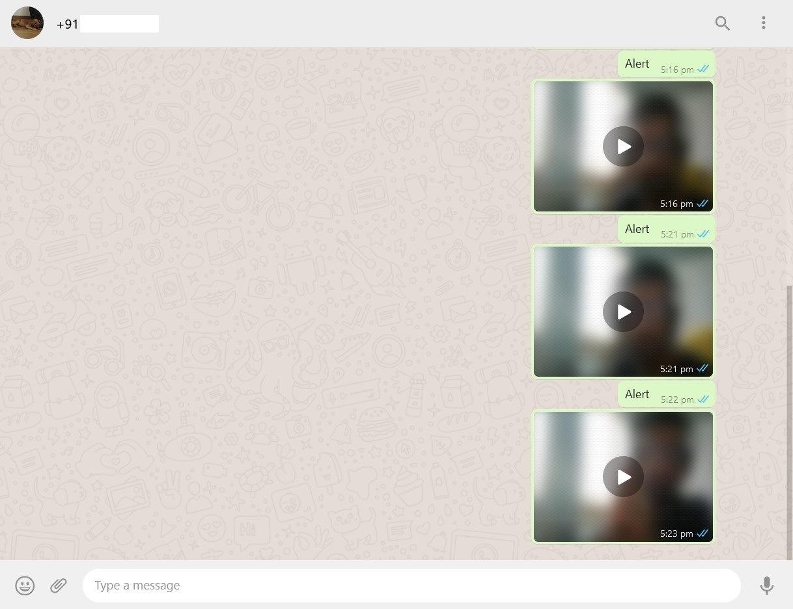

# AI-Surveillance-System
With the pandemic, managing security of facilities has become cumbersome. Monitoring thousands of cameras with hours of camera feed requires an unsustainable workforce which can send the operating costs of a company through the roof. 

Our solution uses AI to detect anomalies in video feed to flag potential physical criminal activity. We implement a 2018 CVPR paper on crime detection, with a model trained from scratch using the appropriate crime categories, like ‘burglary’ and ‘fighting’. 
The model is deployed as a web app that receives camera frames and outputs the probability of each half-second interval of video being anomalous. On detection, the app sends a Whatsapp "Alert" message to the registered user along with a short clip of the anomalous incident. 

For this project we have implemented the following CVPR 2018 research paper:
[Link](https://openaccess.thecvf.com/content_cvpr_2018/papers/Sultani_Real-World_Anomaly_Detection_CVPR_2018_paper.pdf)

We have built a Deep Learning based 3D convolutional network which takes in a video feed and gives out a score corresponding to whether or not there is an occurence of an anomaly (Theft or Assault). 
In order to make this functional and interactive, we have deployed the trained model on a Dash interface. There are three main functionalities attached to this app .
**To run the webapp, execute app1.py scripts.**

### Sends an Alert and Proof Video to the Whatsapp number given by the user on the Home Page

### Starting the live feed through a webcam

### Viewing all the clips that the model tagged as an anomaly in the most recent run

### Some sent messages

## Modules
The scripts used for training are given here: [Scripts](scripts/)

The trained models and weights can be found here: [Models](models/)

The scripts to design the app on Dash can be found here: [App Scripts](app/)

Videos which were marked as an anomaly by the model can be found here: [Anomalous videos](app_uploaded_files/)

